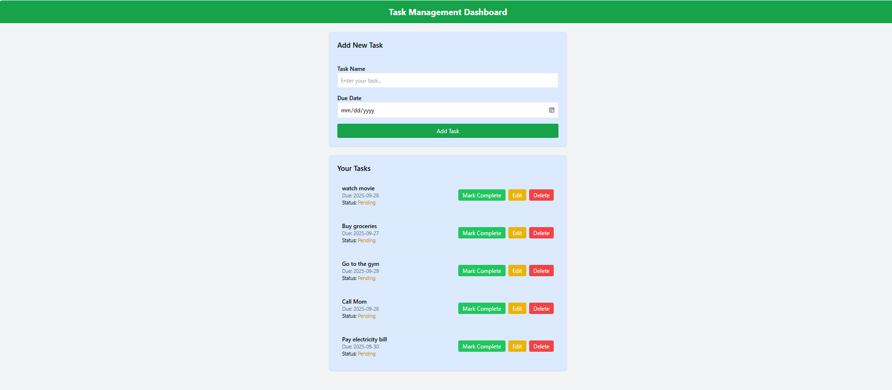
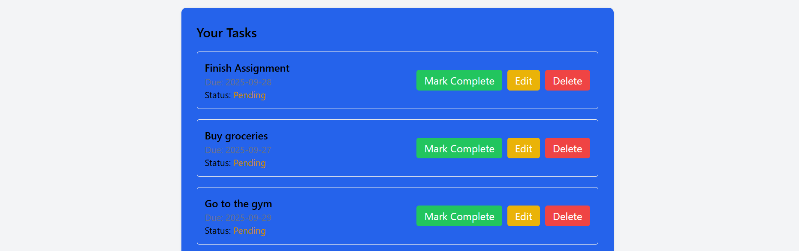

## Description

The Task Management Dashboard is a web-based application designed to help users efficiently manage their daily tasks. It allows users to create, view, edit, delete, and track the status of tasks in a simple and interactive interface. The project is built using HTML5, JavaScript, and Tailwind CSS, providing a responsive and user-friendly design suitable for desktops, tablets, and mobile devices

## Purpose

The main goal of this project is to simulate a real-world task management workflow, helping users organize and prioritize their tasks efficiently. Additionally, the project serves as a practical exercise to:

Practice DOM manipulation using JavaScript.

Work with arrays and objects to manage dynamic data.

Apply responsive UI design principles using Tailwind CSS.

## Deployed link 

https://task-management-board-lovat.vercel.app/
